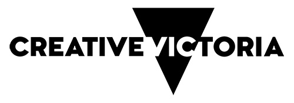

# Model Colour Editor
## Features
- Convert material colours to vertex colours on import
- Override vertex colours on a per-mesh basis with a centralised editor window
- Extendable interface for generating colours for sets of meshes via custom Scriptable Objects

## Installation
Install via one of the following options:
- Add the following Git URL to the Unity Package Manager:
  >```https://github.com/samcrisp/model-colour-editor.git#release```
- [Download the latest package](https://github.com/samcrisp/model-colour-editor/releases/latest) and install in either of the following ways:
  - Open the Package Manager and select "Import package from disk..." and select the .unitypackage file.
  - From the Assets menu select "Import Package > Custom Package..." and select the .unitypackage file. Model Colour Editor requires the [Editor Coroutines](https://docs.unity3d.com/Packages/com.unity.editorcoroutines@1.0/manual/index.html) package to be installed as a dependency. Installing this way will not resolve the dependency automatically. You can either install Editor Coroutines manually before importing the Model Colour Editor package or move the Model Colour Editor from the Asset folder and into the Packages folder of your project and Unity will install the dependent package automatically.

## Getting Started
- Open the editor window from the menu "Window > Model Colour Editor".
- Select one or more meshes or models from the Project or Hierarchy windows.
- From the Model Colour Editor window you can:
  - Preview any vertex colours in the selection.
  - Add vertex colour overrides.
  - Enable importing material colours from a model as vertex colours.
  - Create and use Colour Picker Tools to generate various colours on multiple meshes.

Note: You will need a material which can display vertex colours in order to render them. Unity's default shaders don't use vertex colours out of the box, however Model Colour Editor provides some Materials that render vertex colours in the Examples folder of the package. If you have installed the package via the Package Manager, the example materials can be found in the Project directory under "Packages/Model Colour Editor/Examples/Materials".

## Acknowledgements
This plugin is supported by the Victorian Government through Creative Victoria.

